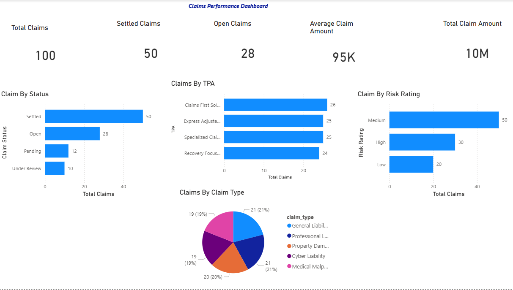

# claims-analytics-warehouse

End-to-end insurance claims analytics platform built using Python, Azure Blob Storage, Power BI, and GitHub.

The project follows a Bronze-Silver-Gold architecture to transform raw insurance datasets into business-ready analytics outputs and interactive dashboards.

## Project Architecture

Raw Insurance Data
        ↓
Bronze Layer
        ↓
Python Data Cleaning & Validation
        ↓
Silver Layer
        ↓
KPI & Analytics Generation
        ↓
Gold Layer
        ↓
Azure Blob Storage
        ↓
Power BI Dashboard

## Technologies Used

- Python
- Pandas
- Azure Blob Storage
- Azure Data Factory
- Power BI
- Git & GitHub
## Azure Data Factory Features
--Parameterized datasets
--Dynamic file processing
--Get Metadata activity
--ForEach activity
--If Condition activity
--Copy Data activity
--Pipeline variables for audit tracking
--Schedule triggers
--Pipeline monitoring
--Error investigation and troubleshooting

## Gold Layer Outputs

- claims_kpis.csv
- claims_by_status.csv
- claims_by_risk_rating.csv
- claims_by_TPA.csv
- claims_by_claim_type.csv

## Dashboard Features

- Claims KPIs
- Claims by Status
- Claims by Risk Rating
- Claims by TPA
- Claims by Claim Type

## Future Enhancements

--Azure SQL Database integration
--Automated data quality checks
--CI/CD deployment pipeline
--Power BI Service deployment

  ## Power BI Dashboard

